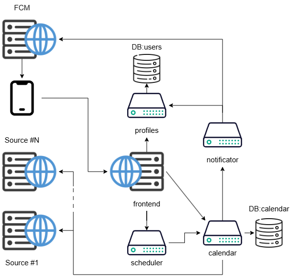

# Idea
C++ planner microservice app

When there are a lot of tasks it is difficult to keep an up-to-date schedule, especially if you don't know enough about your tasks (start time, place, duration, etc.).  When you need to reschedule existing tasks you often have to reorder them due to intersections, dependencies and limited resources. The same happens when you first build a schedule. The idea of this app is to automate such routine processes and make daily schedule management easier

# Solution

## Microservices
This web application is based on 5 services. 4 of them use REST API to interact. 
### List
0. frontend - backend api gate (reverse proxy) and frontend server
1. users (port 5700) - users database API. It also performs passwords hashing
2. calendar (port 5701) - calendars/events/scheduling results database API. It also updates calendars from external sources
3. scheduler (port 5702) - reschedule computer
4. notifier (port 5703) - service maintaining user notifications
### Graph


## Setup
To startup a project you need to execute
```shell
cd users
drogon_ctl create model models
cd ../calendar
drogon_ctl create model models
```
to produce database models sources
